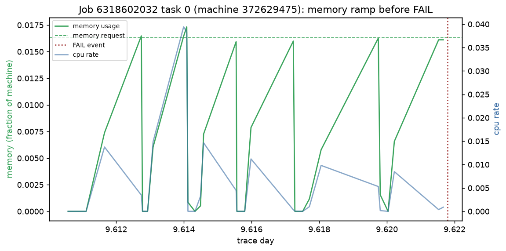
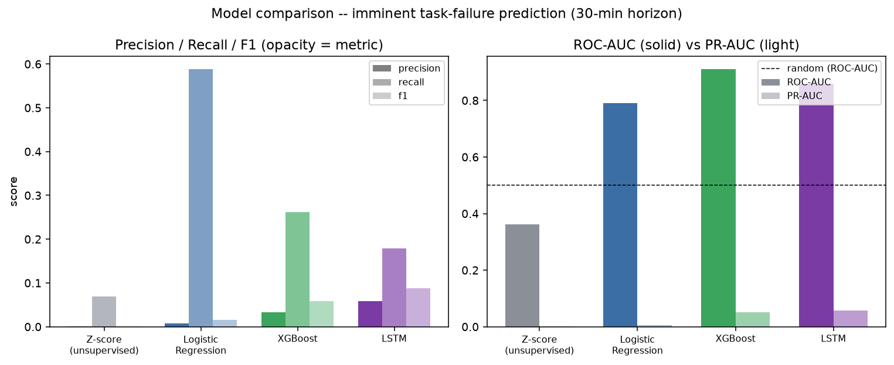
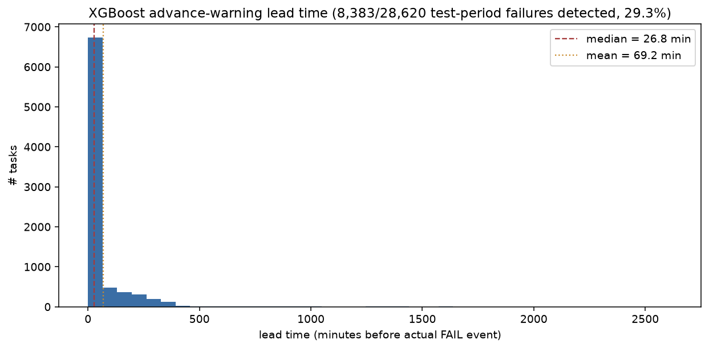

# GSC26 Challenge 3 — Team #316

**IEEE Computer Society Global Student Challenge 2026** · Challenge 3: Analyzing Resource
Usage in Data Center Computers and Predicting Events (Failures or Performance Slowdowns)

Solo entrant: Het Patel · Phase I window: Jul 13 – Aug 9, 2026, 11:59pm ET

## Key findings

- **The tuned XGBoost model gives real advance warning**: for tasks that go on to fail, it
  raises an alert a median of **26.8 minutes** before the actual `FAIL` event, catching
  **29.3%** of held-out failures before they happen — see [Lead-time analysis](#lead-time-analysis).
- It's also the strongest of **5 models compared head-to-head** on an identical time-based
  split: PR-AUC 0.068 (~31x the 0.22% base rate), up **+33%** over the untuned baseline from
  a 12-trial hyperparameter search — see [Results](#results).
- EDA surfaced a concrete, visually verifiable failure mechanic, not just aggregate stats: a
  **memory-usage sawtooth pattern ~16 minutes before a task `FAIL` event** (repeated
  alloc/release cycles ramping toward the memory request each time) — shown below.
- A naive unsupervised baseline (global z-score anomaly detection) scores **below random**
  (ROC-AUC 0.36) — "just flag outliers" is actively misleading at cluster scale, since one
  task's normal load is another's outlier. Reported as a real finding, not hidden.
- The same approach extends to a second, far sparser target — **machine-level hardware
  failure** (0.035% positive rate, ~13x rarer than task failure) — still recovers real signal
  (ROC-AUC 0.62), and its top feature (task churn) independently validates the EDA's
  "churn precedes machine `REMOVE`" hypothesis with a trained model, not just one example.



*Job 6318602032, task 0: memory usage ramps toward its request in repeated sawtooth cycles,
observed for ~16 minutes before the task's `FAIL` event (dotted red line) — a concrete
resource-exhaustion mechanic found by EDA, not an aggregate statistic. Full writeup:
[`notebooks/EDA_FINDINGS.md`](notebooks/EDA_FINDINGS.md).*

## Problem statement

Given time-series resource-usage telemetry from a large-scale data center cluster (CPU,
memory, disk I/O), build a system that:

1. **Detects anomalies** in resource usage without relying on labels.
2. **Predicts failure before it happens**, with an explicit prediction horizon and a measured
   lead time — not just flagging that something is currently wrong.
3. Is evaluated with time-aware, imbalance-aware metrics (PR-AUC, not accuracy — failures
   are rare), compared across a spectrum of model complexity, and shipped as a reproducible
   pipeline + interactive demo, not a one-off notebook.

**Concretely**: predict whether a running task will receive a `FAIL` event in the next 30
minutes, using its recent resource-usage history — the primary target, with 5 models compared
head-to-head on the identical time-based split (z-score anomaly detection, logistic
regression, XGBoost, tuned XGBoost, and an LSTM sequence model). A second target — will a
*machine* receive a `REMOVE` event (hardware failure/decommission) — is built the same way as
a parallel, much sparser prediction problem.

Full technical rationale: [`docs/01-DEEP-DIVE.md`](docs/01-DEEP-DIVE.md) · week-by-week
plan: [`docs/02-IMPLEMENTATION-PLAN.md`](docs/02-IMPLEMENTATION-PLAN.md) · EDA writeup:
[`notebooks/EDA_FINDINGS.md`](notebooks/EDA_FINDINGS.md) · full results + methodology notes:
[`docs/03-BASELINE-RESULTS.md`](docs/03-BASELINE-RESULTS.md)

## Dataset

**Google Cluster Trace 2011-2** (v2) — 29 days, 12,583 machines, one Borg cell, ~672k jobs,
~25.4M tasks. Public on GCS bucket `clusterdata-2011-2`, downloadable over plain HTTPS with
no `gcloud`/account required. Chosen over the 2019 (v3) trace because v3 is 2.4TB of nested
JSON requiring BigQuery, while v2 is plain CSV and matches the trace used in prior published
Bi-LSTM failure-prediction papers, giving a literature baseline to compare against.

`task_usage` (the per-task resource-usage time series) only has **continuous** per-task
history for trace days 0–10 (shards 0–172) — see [`data/README.md`](data/README.md) for why
(an evenly-spaced sample looks continuous in aggregate but is actually disjoint 83-minute
snapshots; this was caught via a sawtooth artifact in an early plot). All feature
engineering below uses that continuous window so per-task time-series features are valid.

Download it yourself with `src/ingest/download_google_trace.py` — see **Setup** below.

## Approach

```
raw CSVs ─▶ typed parquet ─▶ EDA ─▶ 30-min sliding-window features ─▶ 5 models ─▶ lead-time +
(ingest)    (build_parquet)  (01_eda) (build_features / machine_features)  (compared    dashboard
                                                                             on the same
                                                                             time split)
```

1. **Ingestion** (`src/ingest/`): stream raw CSVs into typed, compressed parquet via polars,
   with an explicit schema (raw files are headerless) and a manifest of row counts/null rates.
2. **EDA** (`notebooks/01_eda.py`): trace-wide stats, event-type distributions, usage
   distributions, failure-rate-over-time (concept-drift check), and two concrete worked
   examples — the memory-usage sawtooth above, and cluster load in the 3 days before a
   machine `REMOVE`.
3. **Feature engineering**: each task's (`src/features/build_features.py`) or machine's
   (`src/features/machine_features.py`) usage samples are bucketed into non-overlapping
   30-minute windows with CPU/memory/disk usage stats (mean/std/max) plus static features
   (resource requests/scheduling class for tasks; capacity/task-churn for machines).
   **Label**: 1 if a `FAIL` (task) / `REMOVE` (machine) event — looked up from the *full*
   29-day event tables, never truncated by the 10-day usage window — falls in the 30 minutes
   after the window ends. Task-level: 66.6M windows, 8.2M tasks, 0.18% positive rate.
   Machine-level: 6.0M windows, 12,558 machines, 0.035% positive rate.
4. **Split** (`src/eval/dataset.py`): time-based on window end time (last 20% of the trace
   held out) — never random, so no model ever sees the future. Train is undersampled 20:1
   negative:positive; test is left at its natural imbalance.
5. **Task-failure models** — see [Results](#results):
   - `src/models/anomaly/zscore_baseline.py` — unsupervised, per-feature z-score vs. the
     "normal" (non-imminent-failure) training distribution.
   - `src/models/prediction/logreg_baseline.py` — logistic regression, F1-tuned threshold.
   - `src/models/xgboost_model.py` — gradient-boosted trees, GPU-accelerated, early stopping.
   - `src/models/tune_xgboost.py` — 12-trial random search + 3-fold CV over
     `n_estimators`/`max_depth`/`learning_rate`/`subsample`/`colsample_bytree`, refit with
     early stopping — **+33% PR-AUC** over the untuned baseline.
   - `src/models/lstm_model.py` — sequence model over the last 6 windows (3h) per task,
     trained on GPU. Trained on a task subsample (memory-bounded), but *evaluated* on the
     full test-period task universe via chunked scoring — same scope as the other 4 task-failure models.
6. **Machine-failure model** (`src/models/machine_xgboost.py`): same recipe applied to the
   machine-level `REMOVE` target — a second, much sparser prediction problem, tracked
   separately (see `docs/03-BASELINE-RESULTS.md`).
7. **Lead-time analysis** (`src/eval/lead_time.py`): for every test-period task with an
   observed imminent-failure window, finds the model's *first* alert before the real failure
   and measures the advance warning in minutes — the metric that makes this project more than
   a leaderboard number.
8. **Comparison** (`src/eval/compare_models.py`): reads every model's saved metrics and
   produces the results table + comparison plot below.
9. **Dashboard** (`app/dashboard.py`): Streamlit app over a small precomputed sample —
   an **Overview** tab (usage/risk over time with actual event markers, model comparison
   table) and a **Live Simulation** tab (scrub a time slider to watch usage and predicted
   risk unfold toward the real failure, as an operator would have seen it live).

## Results

Time-based test split, 30-minute imminent-failure horizon (all 5 models scored on the same
13,263,258-row test set — see the LSTM scope note in `docs/03-BASELINE-RESULTS.md`):

| Model | Precision | Recall | F1 | ROC-AUC | PR-AUC |
|---|---|---|---|---|---|
| Z-score (unsupervised) | 0.0007 | 0.0692 | 0.0014 | 0.3621 | 0.0015 |
| Logistic Regression | 0.0079 | 0.5882 | 0.0156 | 0.7911 | 0.0055 |
| XGBoost | 0.0328 | 0.2621 | 0.0584 | 0.9105 | 0.0514 |
| **XGBoost (tuned)** | **0.0814** | 0.2398 | **0.1216** | 0.8927 | **0.0683** |
| LSTM | 0.0239 | 0.2298 | 0.0432 | 0.8725 | 0.0264 |



**Reading these**: PR-AUC is the metric that matters at a 0.22% base rate — accuracy would
be ~99.8% for a do-nothing classifier, and ROC-AUC alone can look deceptively good (the
z-score baseline scores *below* random on ROC-AUC because global z-scoring across 8M tasks
with wildly different resource scales is a genuinely weak signal). Tuned XGBoost is the
strongest model on the metric that matters (PR-AUC), trading a small ROC-AUC/recall dip for
a large precision/F1 gain — a good trade under this much imbalance. Full interpretation,
including why the LSTM's numbers changed after a scope-correction bug fix and the
hyperparameter search details: [`docs/03-BASELINE-RESULTS.md`](docs/03-BASELINE-RESULTS.md).

## Lead-time analysis

Of the 28,620 test-period task failures with an observed imminent-failure window, the tuned
XGBoost model raised an alert **before the actual failure for 8,383 of them (29.3%)** —
median lead time **26.8 minutes**, mean 69.2 minutes.



Full methodology (including a boundary-artifact bug this analysis caught and fixed) in
[`docs/03-BASELINE-RESULTS.md`](docs/03-BASELINE-RESULTS.md#lead-time-analysis).

## Repo structure

```
src/
├── ingest/       # raw CSV -> typed parquet (schemas.py, build_parquet.py, downloader)
├── features/     # task-level (build_features.py) + machine-level (machine_features.py)
│                 # sliding-window feature/label construction
├── eval/         # shared time-based split, metrics registry, model comparison,
│                 # lead-time analysis, dashboard-sample builder
└── models/
    ├── anomaly/prediction/  # naive baselines (z-score, logistic regression)
    ├── xgboost_model.py / tune_xgboost.py
    ├── lstm_model.py
    └── machine_xgboost.py   # second prediction target (machine REMOVE)
notebooks/        # EDA (01_eda.py) + findings + figures
app/               # Streamlit dashboard (dashboard.py) -- Overview + Live Simulation tabs
models/            # saved model artifacts (xgboost.pkl, xgboost_tuned.pkl, lstm.pt, machine_xgboost.pkl)
results/           # comparison table/plot, lead-time results, tuning trial log (git-tracked, small)
data/              # raw/processed (gitignored, rebuild locally) + small dashboard sample (tracked)
docs/              # deep dive, implementation plan, full results + methodology writeup
```

## Setup

```bash
python -m venv .venv
.venv\Scripts\activate        # Windows
pip install -r requirements.txt
# then install torch per your hardware (see requirements.txt comment)
```

Confirmed working on this machine: RTX 5060 Laptop GPU (Blackwell, sm_120) requires the
`cu128` torch build — `cu124` installs but throws "no kernel image available."

## How to run everything

Each step's output feeds the next; `data/processed/` and most of `models/*` are gitignored
(except the small dashboard sample and the 3 XGBoost model files) so most of this needs to be
rerun locally after cloning.

```bash
# 1. Download the trace (~27GB; schema.csv/README + full job/task/machine events +
#    a contiguous 10-day task_usage window for time-series features)
python src/ingest/download_google_trace.py --out data/raw/google_cluster_2011 \
    --task-usage-range 0:172

# 2. Raw CSV -> typed parquet
python src/ingest/build_parquet.py

# 3. EDA (figures -> notebooks/figures/, findings -> notebooks/EDA_FINDINGS.md)
python notebooks/01_eda.py

# 4. Feature engineering
python src/features/build_features.py       # task-level (-> features_window30min.parquet)
python src/features/machine_features.py     # machine-level (-> machine_features_window30min.parquet)

# 5. Train + evaluate every model (each appends to data/processed/model_metrics.json)
python src/models/anomaly/zscore_baseline.py
python src/models/prediction/logreg_baseline.py
python src/models/xgboost_model.py
python src/models/tune_xgboost.py
python src/models/lstm_model.py
python src/models/machine_xgboost.py

# 6. Final comparison table + plot, and lead-time analysis (-> results/)
python src/eval/compare_models.py
python src/eval/lead_time.py

# 7. Dashboard sample data (-> data/dashboard_sample.parquet, data/dashboard_events.parquet)
python src/eval/build_dashboard_sample.py
```

## Dashboard

```bash
streamlit run app/dashboard.py
```

Runs off the small git-tracked files from step 7 above (already committed), so it works
right after cloning without needing the full local dataset or GPU. Pick a machine in the
sidebar, then:
- **Overview** — resource usage and tuned-XGBoost predicted failure risk over time, with
  actual `FAIL`/`REMOVE` event markers, plus the 5-model comparison table.
- **Live Simulation** — scrub a time slider to watch usage and predicted risk unfold up to
  that point, with live-updating metrics and the actual event always marked, simulating what
  an operator monitoring that machine would have seen.

## Status

Ingestion, EDA, feature engineering, all 5 task-failure models, a second machine-failure
model, hyperparameter tuning, lead-time analysis, and the dashboard are built and pushed. See
[`docs/02-IMPLEMENTATION-PLAN.md`](docs/02-IMPLEMENTATION-PLAN.md) for the original
week-by-week plan this sprint compressed, and
[`docs/03-BASELINE-RESULTS.md`](docs/03-BASELINE-RESULTS.md) for full results.
